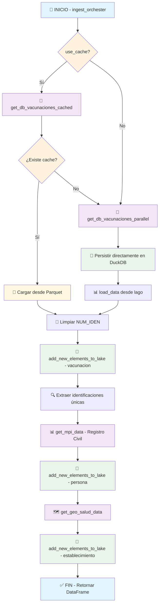
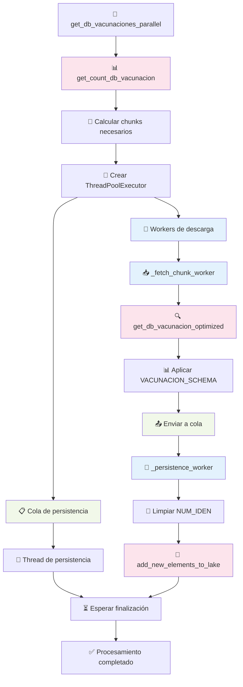
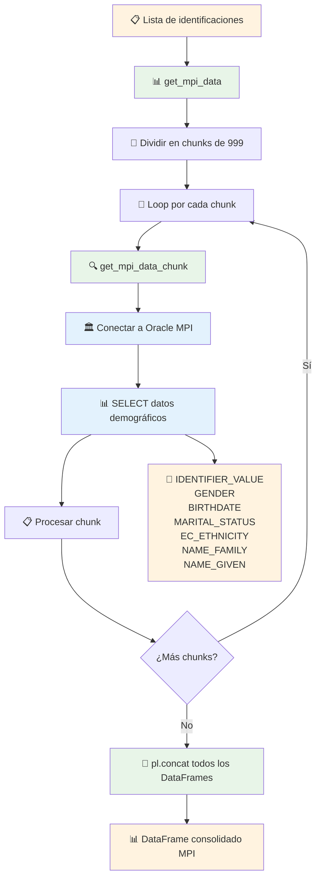
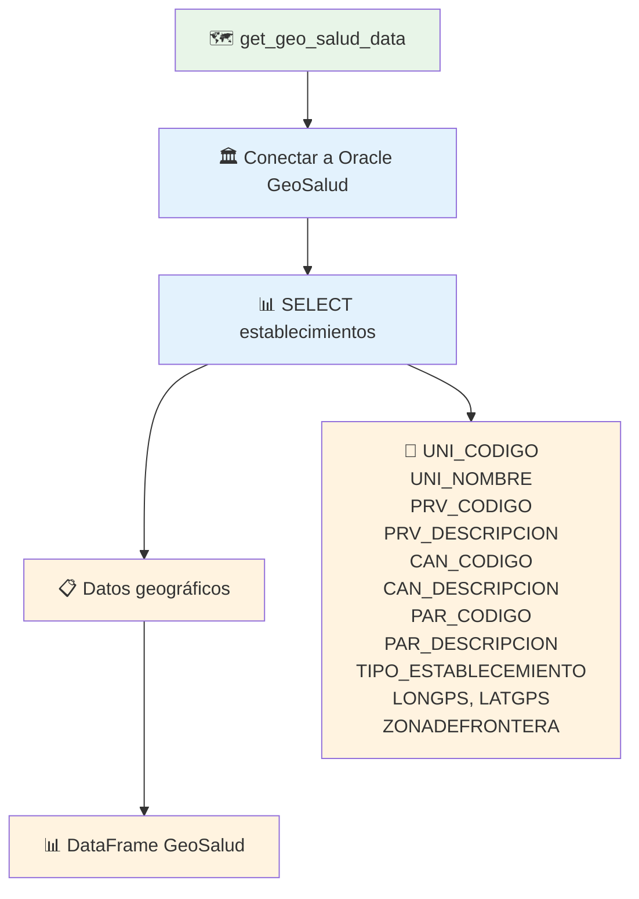
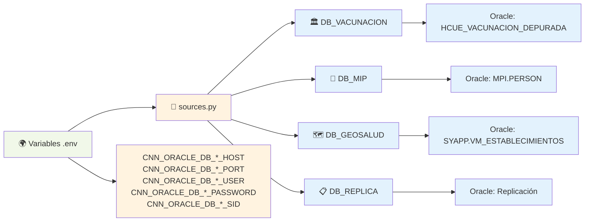
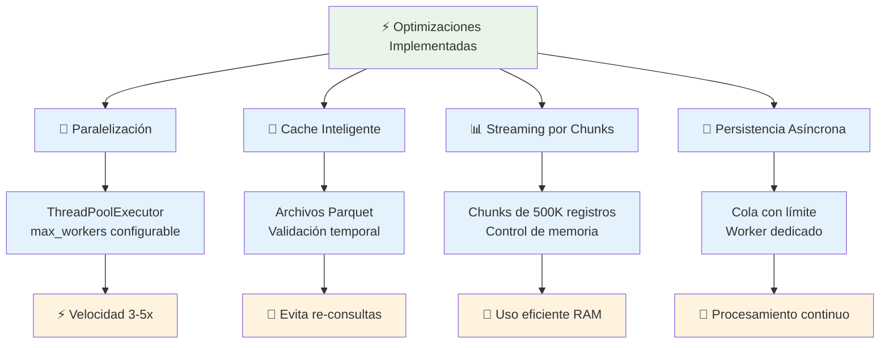

# Diagrama de Flujo - Proceso de Extracción (`extract/`)

## Flujo Principal del Orquestador

## Detalle del Procesamiento Paralelo de Vacunación

## Detalle de Extracción MPI (Registro Civil)

## Detalle de Extracción GeoSalud

## Configuración de Conexiones

## Flujo de Optimizaciones

---

## 📊 Métricas del Proceso

- **Volumen típico**: Millones de registros de vacunación
- **Chunk size**: 500,000 registros por defecto
- **Workers paralelos**: 4 por defecto (configurable)
- **Límite MPI**: 999 identificaciones por consulta
- **Cache**: Archivos Parquet para evitar re-consultas
- **Bases de datos**: 3 fuentes Oracle independientes

## 🎯 Resultado Final

El proceso genera tres tablas en el data lake (DuckDB):
- `lk_vacunacion` - Eventos de vacunación
- `lk_persona` - Datos demográficos del registro civil  
- `lk_establecimiento` - Información geográfica de centros de salud

## 📁 Archivos del Directorio Extract

### `ingest_orchester.py`
- **Función principal**: Coordina todo el proceso de extracción
- **Parámetros**: `since`, `until`, `chunk_size`, `max_workers`, `use_cache`
- **Flujo**: Vacunación → MPI → GeoSalud → Persistencia

### `db_vacunacion.py` 
- **Función principal**: Extracción masiva de datos de vacunación
- **Optimizaciones**: Paralelo, cache, streaming, persistencia asíncrona
- **Schema**: 41 campos definidos con tipos Polars
- **Conexión**: Oracle HCUE_VACUNACION_DEPURADA

### `mpi.py`
- **Función principal**: Extracción de datos demográficos
- **Limitación**: Chunks de 999 identificaciones por consulta Oracle
- **Conexión**: Oracle MPI.PERSON
- **Campos**: Identificación, género, nacimiento, etnia, nombres

### `geo_salud.py`
- **Función principal**: Extracción de datos geográficos
- **Conexión**: Oracle SYAPP.VM_ESTABLECIMIENTOS_INGRESADOS  
- **Campos**: Códigos, nombres, coordenadas, tipos, zona frontera

### `config/sources.py`
- **Función principal**: Configuración de conexiones Oracle
- **Variables**: Cargadas desde archivo `.env`
- **Motores**: SQLAlchemy engines para cada base de datos